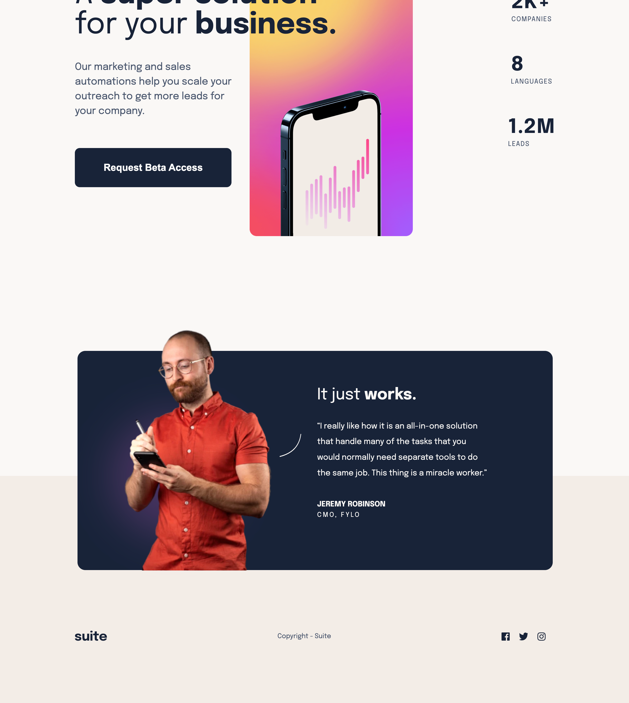

# Frontend Mentor - Suite landing page solution

This is a solution to the [Suite landing page challenge on Frontend Mentor](https://www.frontendmentor.io/challenges/suite-landing-page-tj_eaU-Ra). Frontend Mentor challenges help you improve your coding skills by building realistic projects.

## Table of contents

- [Overview](#overview)
  - [The challenge](#the-challenge)
  - [Screenshot](#screenshot)
  - [Links](#links)
- [My process](#my-process)
  - [Built with](#built-with)
  - [What I learned](#what-i-learned)
  - [Continued development](#continued-development)
  - [Useful resources](#useful-resources)
- [Author](#author)


## Overview

### The challenge

Users should be able to:

- View the optimal layout depending on their device's screen size
- See hover states for interactive elements

### Screenshot



### Links

- Solution URL: [https://github.com/Peteonthebeat/Suite-Landing-Page.git]
- Live Site URL: [https://peteonthebeat.github.io/Suite-Landing-Page/]

## My process

### Built with

- Semantic HTML5 markup
- CSS custom properties
- Flexbox
- CSS Grid
- Mobile-first workflow

### What I learned

Well, I wouldn't say I learning anything new in particular. I'm glad I exercised background images and nth selections.


```html
    <div class="socials">
        <a class="social-link"></a>
         <a class="social-link"></a>
         <a class="social-link"></a>
       </div>
```

```css
.socials {
    display: flex;
    margin: 5em 0;
    .social-link {
      margin: 0 1.5rem 0 0;
    }
    .social-link:nth-of-type(1) {
      background-image: url(/images/assets/icon-facebook.svg);
      background-size: cover;
      background-position: center;
      height: 20px;
      width: 20px;
    }

    .social-link:nth-of-type(2) {
      background-image: url(/images/assets/icon-twitter.svg);
      background-size: cover;
      background-position: center;
      height: 20px;
      width: 20px;
    }
    .social-link:nth-of-type(3) {
      background-image: url(/images/assets/icon-instagram.svg);
      background-size: cover;
      background-position: center;
      height: 20px;
      width: 20px;
    }
    .social-link:hover {
      cursor: pointer;
      transition: 0.5s ease-out;
      filter: invert(59%) sepia(16%) saturate(145%) hue-rotate(185deg) brightness(88%) contrast(83%);
    }
  }
```

### Continued development

The last few challenges I did heavily emphasized using background images on landing pages. While I realize knowing how to do that is awesome, based on personal observation, I think that's more of an exotic. So, now I'd like to move some 'more functional' stuff like actually building multipage websites with sections, forms, embedded videos, sidebars, etc...


### Useful resources

- [https://isotropic.co/tool/hex-color-to-css-filter/]
- [https://www.w3schools.com/]

## Author

- Website - [peteonthebeat.com]
- Frontend Mentor - [@peteonthebeat]
- YouTube - [@POTB_Tech](https://www.youtube.com/channel/UCLwFWrYji6b5UcHQ7o4BEvg)
